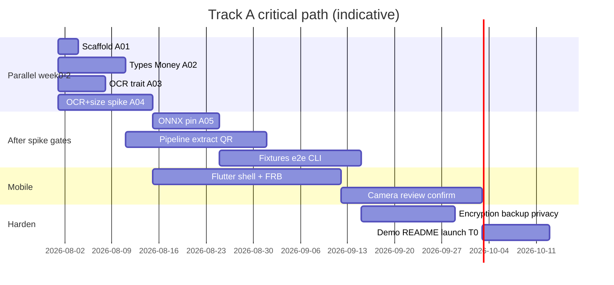
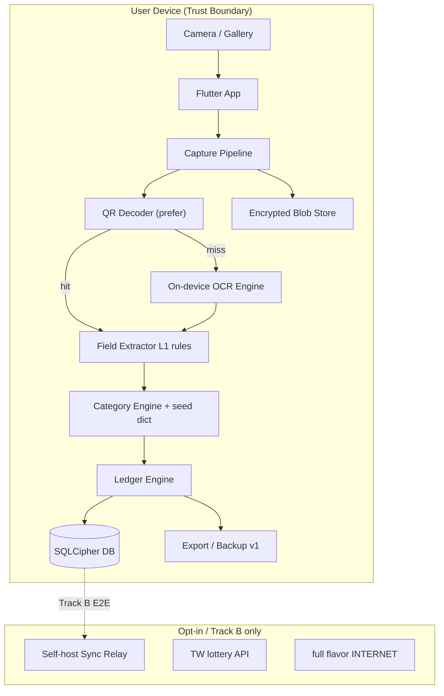
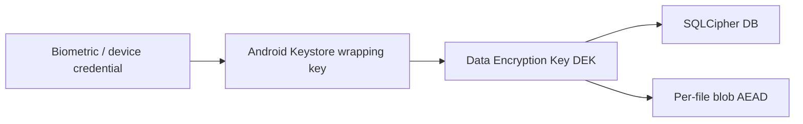
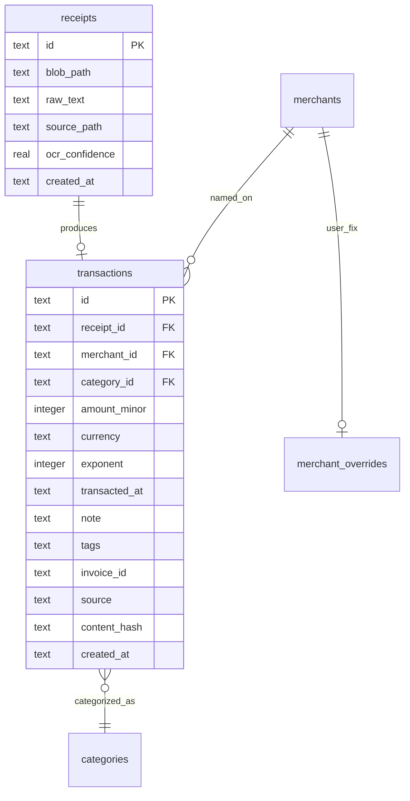
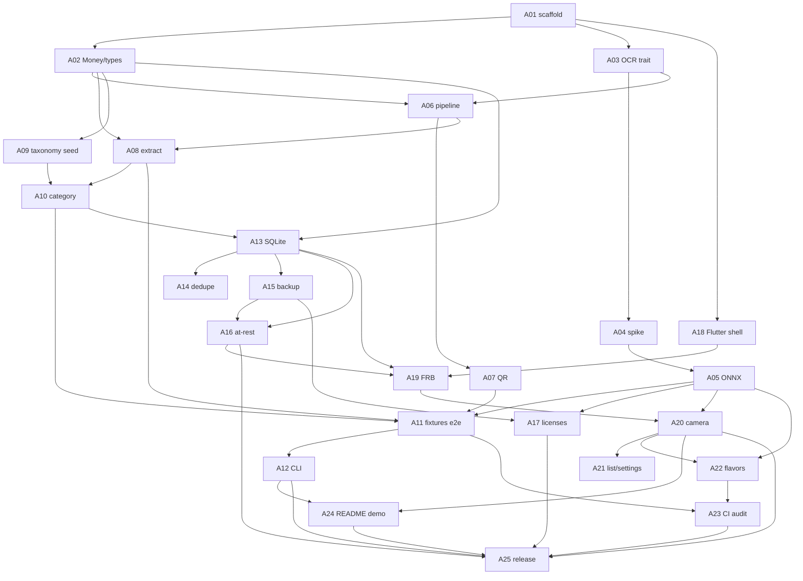

# ReceiptRadar（發票雷達）— 本地優先、相機即帳本的開源家計系統

| 欄位 | 內容 |
|------|------|
| **文件標題** | ReceiptRadar（發票雷達）系統與開源產品設計 |
| **作者** | OSS Core Team（placeholder） |
| **日期** | 2026-07-30 |
| **修訂** | 2026-07-30 r4（PO 定案：無官方 relay；側載+F-Droid；FLAG_SECURE 預設開） |
| **狀態** | Draft（implementation-ready; Track A 可開工；OQ-2/5/6 已定案） |
| **授權** | Apache-2.0（**原始碼核心**）；模型權重與第三方見 `THIRD_PARTY_NOTICES`／獨立 release asset |
| **目標版本** | **v0.1 thin slice** → v0.2 → v1.0 |

---

## Overview

**ReceiptRadar（發票雷達）** 是一個 **local-first（本地優先）** 的日常消費記帳系統：用手機相機拍一張發票／收據，在裝置上完成 OCR（或 QR 解碼）、商家識別、金額抽取、消費分類，並寫入本機帳本。核心路徑 **不需要帳號、不需要雲端、不上傳影像**——資料預設只留在使用者裝置上。

它要解決的日常摩擦極為普遍：多數人不是「不會記帳」，而是 **懶得手動輸入**。ReceiptRadar 的 GitHub 震撼點在於：**可重現的 Demo**——對準紙本發票 → **數秒內**（on-device）產出結構化草稿 → 確認後儀表板更新——README 大字 **「No cloud. No account. On-device.」**。行銷文案在 OCR spike 量測完成前 **不承諾固定 0.5–2s**；以 *“seconds, on-device”* 為準，數字以 measured 表格為 SSOT。

### v0.1 唯一出貨定義（Thin Vertical Slice）

| 必達（Track A / v0.1） | 明確不進 v0.1（Track B+） |
|------------------------|---------------------------|
| CLI：`rradar process` + **真實 ONNX OCR**（桌面） | WASM 完整 ONNX 瀏覽器 demo |
| Golden fixtures：**像素 → e2e** 指標 + 文字-only 解析指標分離 | Desktop Tauri companion |
| Android **debug APK**：相機 → review → 入帳 → 簡易列表／月總計 | Self-host E2E sync |
| **加密備份** `backup.rradar` v1 + 匯出 CSV/JSON | 預算告警、批次 10 張佇列 |
| 本機 **at-rest 加密**（DB + 影像 blob） | 官方託管 relay、中獎 API |
| README：GIF（真實管線錄製）+ CLI 一鍵重現 | iOS、第二 taxonomy 大擴充 |
| 離線 flavor 策略與隱私 onboarding | 家庭共同帳本／多使用者 |

**可 trending 的最低門檻 = Launch Tier T0**（見 Rollout）：GIF + CLI 真實 OCR 跑 fixtures——**不**要求上架商店或 WASM。

### 人員假設（1–3 人，約 12–16 週 Track A）

| 角色 | 人數 | 責任 |
|------|------|------|
| Core / ML / CLI | 1 | Rust 管線、ONNX、抽取、fixtures、CLI、backup |
| Mobile | 1 | Flutter、相機、FFI、review UX、Android 打包 |
| Product / docs / launch（可兼） | 0.5 | README、demo 錄製、merchant seed、隱私文案 |

### 技術形狀（v0.1）

- **`rradar-core`（Rust）**：前處理、OCR 編排、QR 優先路徑、規則抽取、分類、帳本、備份
- **`rradar-cli`**：開發者 wow + CI 閘門
- **`apps/mobile`（Flutter + flutter_rust_bridge）**：唯一行動 UI 棧（已凍結，見 KD-3）
- Track B：desktop、WASM playground、budget、SMS…（**無**官方 sync-relay）

---

## Background & Motivation

### 當前狀態與痛點

| 痛點 | 現況 | 使用者感受 |
|------|------|------------|
| 手動記帳成本高 | 需逐筆輸入商家、金額、分類 | 三天後放棄 |
| 雲端家計 App | 訂閱制、資料在第三方 | 消費影像進黑箱 |
| 銀行／支付匯出 | CSV 難讀、分類爛 | 週末才整理，已失真 |
| 紙本發票 | 超商小票、餐廳明細、電子發票證明聯 | 拍完進相簿即消失 |
| 開發者工具錯位 | 開源多是 CLI／CSV | 普通人用不下去 |

### 為什麼現在做

1. 端側 OCR／QR 解碼在中階手機已可跑通「機打收據」主場景（準確率以人工修正補）。
2. Local-first 敘事在 GitHub 具傳播力（Immich、Whisper.cpp 類故事）。
3. 日常高頻：餐食、交通、日用——非開發者專屬。
4. 台灣電子發票 **QR 結構化欄位** 可作為高準確率捷徑（品牌「發票雷達」的在地深度），同時保留全球通用影像 OCR 路徑。

### 產品定位一句話

> **把「拍收據」變成「自動帳本」——而且整條路都在你的裝置裡完成。**

### 與既有開源的差異（非完整競品調研，實作前再補一頁）

| 類型 | 例子 | 差異 |
|------|------|------|
| 自架家計 | Firefly III | 無「相機→離線 OCR」主路徑；偏雲端帳本 |
| 文件歸檔 | paperless-ngx 等 | 文件庫不是消費分類帳本 |
| 帳本格式 | Beancount | 極客複式；可作 **export 目標（Track B）** 非 UX 核心 |
| 收據 GitHub 專案 | 各 OCR demo / 記帳實驗 | 少見完整 local-first 產品化 + 加密備份 + 可貢獻 merchant 規則 |

---

## Goals & Non-Goals

### Goals

1. **日常可用（v0.1）**：冷啟動（含模型就緒）後 5 分鐘內完成第一筆離線記帳。
2. **Local-first 預設**：影像、OCR 文字、交易預設不離裝置；任何網路皆 opt-in 且可審計。
3. **Wow demo（T0）**：15 秒 GIF + `rradar process fixtures/...` 可在無手機下重現。
4. **可擴充**：`OcrEngine`／taxonomy／地區 adapter 可插拔。
5. **可審計開源**：原始碼 Apache-2.0；模型與依賴授權可盤點；無隱藏電話回家（CI egress 閘門）。
6. **小團隊可交付**：v0.1 = 上表 thin slice；P0 能力以 **Phase 1 八大能力桶**（見下）為準，不另設「≤8 列」計數。

### Non-Goals

| Non-Goal | 適用版本 | 原因 |
|----------|----------|------|
| Open Banking／銀行聚合 | 全部 | 合規與維護地獄 |
| 專業報稅／ERP | 全部 | 家計工具 |
| SaaS 訂閱鎖核心功能 | 全部 | OSS 信任 |
| GPT 聊天財務顧問 | 全部 | 紅海、無系統差異 |
| 強制帳號 | 全部 | |
| 跨幣別自動 FX 加總 | v0.1–v1 | 正確性陷阱；見 Money 模型 |
| **WASM 完整 OCR、Desktop、Sync、Budgets、iOS** | **v0.1** | 時程；見 Track B |
| **家庭共同帳本／多 profile** | v0.1 | 僅 CSV／加密備份分享 |
| 100% OCR 完美 | 全部 | 人工修正為一等公民 |
| 手寫金額／嚴重褪色單 | v0.1 | 見支援矩陣 |

---

## Product Vision

### 命名

| 用途 | 名稱 |
|------|------|
| EN | **ReceiptRadar** |
| 中文 | **發票雷達** |
| Repo | `receiptradar/receiptradar` |
| CLI | `rradar` |
| Tagline | *Snap. Parse. Own your spending.* / *拍下發票，帳本留下——不上雲。* |
| GitHub 副標 | Offline receipt → ledger in seconds. Local-first. No account. |

### 目標使用者

1. **Primary：隱私敏感的個人／家庭記帳者（25–45）**  
   想知道錢花去哪，不想把收據影像交給封閉 App。
2. **Secondary：需要報銷／分攤的個人**  
   v0.1 價值 = **CSV／JSON 匯出 + note/tags 備註**（例如「室友該付」），**不是**共同帳本或即時多人同步。情侶／室友場景透過「匯出檔傳給對方」完成，直到 Phase 3 才考慮 household。
3. **Tertiary：開發者／自架愛好者**  
   CLI、fixtures、F-Droid offline flavor；多裝置僅加密備份／匯出（**無官方 sync relay**；社群自架若有亦不由 maintainer 營運）。

### Day-in-the-life（對齊 v0.1 能力）

**小芸，32 歲**

1. 中午超商買便當，拍證明聯／明細 → 若有 QR 優先解碼，否則 OCR → review 卡：「全家 · TWD 89 · 餐飲」→ 確認入帳。  
2. 晚上打開 App：本月 **單一幣別** 支出合計與分類列表（簡易；精美 pie 可有但不阻塞 v0.1）。  
3. 週末把 `backup.rradar` 拷到筆電保存；或匯出 CSV 自己用試算表。  
4. **不在 v0.1**：批次連拍 10 張佇列、男友即時共同帳本、中獎查詢推播。

### Killer Demo（15 秒，真實管線）

```text
[0:00] 黑底：No cloud. No account. On-device.
[0:02] 對準皺巴巴超商發票（實拍）
[0:04] 快門；若有 QR 先閃「QR hit」微標
[0:06–0:10] Review sheet：Store / Total / Date / Category（允許略卡頓，勿假加速）
[0:11] 確認 → 列表多一筆
[0:13] Settings：All data on device ✅  Build: offline  Network permission: none（offline flavor）
[0:15] ReceiptRadar — Apache-2.0 (code)
```

**資產：** `docs/demo/receipt-demo.webm` + `demo.gif`；`fixtures/receipts/` 含矩陣標籤；`rradar process` 重現。

---

## v0.1 支援收據矩陣

| 類型 | v0.1 | 策略 |
|------|------|------|
| 台灣熱感 POS 超商／餐飲 **機打** 明細或證明聯 | ✅ 主力 | QR 優先 → OCR fallback |
| 台灣電子發票 **雙 QR**（公開規格欄位） | ✅ | `rradar-qr`／core 內 zbar/rxing 解碼 + 欄位解析 |
| 一般英文／數字機打收據（USD 等） | ✅ best-effort | OCR + L1 規則 |
| 藥妝／量販機打長卷 | ⚠️ partial | 金額候選排序；可能需人工改 |
| 手寫金額、手寫簽單、嚴重反光／褪色 | ❌ | 引導重拍或全手動建立交易 |
| 複寫紙模糊、純印章無總計 | ❌ | 同上 |
| 載具歸戶雲端查詢 | ❌ v0.1 | Track B；且屬網路 opt-in |

**金額候選優先序（L1）：**  
`總計` / `Total` / `AMOUNT DUE` > `合計` / `應收` > 信用卡簽單總額 > 其餘最大合理金額；排除統編（8 位）、電話、數量欄。

**TW 發票號碼 vs 統編：**  
- 統編：8 位數字（checksum 可選驗證）→ 不當金額。  
- 發票字軌號碼：依公開格式解析 → `invoiceId` 高 conf。  
- 民國日期：`YYY/MM/DD` → ISO date。

**QR 路徑（GitHub wow + 準確率）：**  
若偵測到電子發票 QR payload，**跳過或降權全頁 OCR** 填入 total/date/invoiceId/seller；商家名仍可 OCR 頂部補強。欄位對照見 **Appendix A**；OQ-4 未清前僅做「使用者拍攝圖上的離線結構解碼」。

---

## Staffing & Critical Path（約 12–16 週）



**排程原則（與 PR 圖一致）：**

- **A02（types/Money）與 A03→A04（spike）平行**，不阻塞於 spike 結束。  
- Spike **只閘道** A05（模型選型鎖定）、measured 延遲／體積 SLO、以及下方 **Spike outcomes** 樞紐；**不**阻擋 domain types／taxonomy 草稿。  
- DB／extract／QR 在 A02 合併後即可推進（可用 mock OCR）。

**長桿風險：** 端側繁中 OCR 延遲／體積／準確率、Flutter↔Rust 影像記憶體、SQLCipher NDK 連結。前 2–4 週用 A04 +（必要時）A16 子 spike 暴露。

---

## Proposed Design

### 高層架構



### 支援 Runtime 表

| Runtime | v0.1 | OCR | 備註 |
|---------|------|-----|------|
| Native desktop (Linux/macOS/Windows) CLI | ✅ | ONNX RapidOCR | CI + launch T0 |
| Android (arm64-v8a) | ✅ | ONNX 預設；`OcrEngine` 可換 | minSDK 見 KD-15 |
| Android 32-bit | ❌ | — | 減體積與維護 |
| iOS | ❌ v0.1 | 後期可接 Apple Vision | Track B |
| WASM browser | ❌ v0.1 完整 OCR | — | T2 可做「貼上 OCR 文字跑規則」誠實 demo |
| Sync relay | ❌ 永不官方 | — | 多裝置 = 備份／匯出；社群可自架但 **非** 本專案維護產物 |

### Monorepo（v0.1 end-state）

```text
receiptradar/
├── LICENSE                          # Apache-2.0 (code)
├── README.md                        # English-primary + 中文節
├── THIRD_PARTY_NOTICES.md
├── Cargo.toml                       # workspace
├── crates/
│   ├── rradar-core/                 # pipeline, extract, ledger, backup
│   ├── rradar-ocr/                  # OcrEngine + onnx + mock
│   ├── rradar-taxonomy/
│   ├── rradar-cli/
│   └── rradar-ffi/                  # flutter_rust_bridge
├── apps/
│   └── mobile/                      # Flutter
├── fixtures/
│   ├── README.md                    # PII / consent / synthetic vs real matrix policy
│   ├── manifest.json
│   ├── qr/                          # TW e-invoice sample payloads (Appendix A)
│   └── receipts/                    # by class; golden json; source tags
├── models/                          # NOT required in git; fetch script + hashes
│   └── README.md                    # how to fetch; licenses
├── docs/
│   ├── privacy.md
│   ├── backup-format-v1.md
│   ├── architecture.md
│   ├── licenses-checklist.md
│   ├── launch/                      # HN/Reddit/PT drafts
│   └── demo/
├── tools/
│   ├── fetch-models.sh
│   ├── bench-ocr/
│   └── network-audit/               # CI: no unexpected egress in offline tests
└── .github/workflows/
```

Track B 再加：`apps/desktop/`, `apps/web-demo/`, `crates/rradar-adapters-tw/`（進階中獎）等。**不**新增官方 `services/sync-relay/` 作為維護產物（見 KD-9）。

### Capture Pipeline

```mermaid
sequenceDiagram
  participant U as User
  participant App as Flutter App
  participant Core as rradar-core
  participant QR as QR Decoder
  participant OCR as OCR Backend
  participant DB as SQLCipher

  U->>App: Capture / pick image
  App->>Core: process_receipt(image, locale, mode)
  Core->>Core: preprocess (adaptive max-edge)
  Core->>QR: try_decode
  alt QR structured hit
    QR-->>Core: fields high conf
  else QR miss / partial
    Core->>OCR: recognize(image)
    OCR-->>Core: TextBlock[]
    Core->>Core: L1 field extract
  end
  Core->>Core: categorize + explain trace
  Core-->>App: ReceiptDraft + ExplainTrace
  App->>U: Review (edit low conf; optional debug chevron)
  U->>App: Confirm
  App->>DB: insert tx + blob ref (dedupe soft-check)
```

### 影像前處理與延遲（Spike 前為 aspirational）

**原則：** 在 **OCR+size spike（Track A 第 0–2 週）** 完成前，下列數字為 **aspirational only**，不得寫進商店文案當保證。Spike 後填入「Measured」表並鎖定 SLO。

| 階段 | Aspirational P50 | Aspirational P95 | 備註 |
|------|------------------|------------------|------|
| Preprocess | 80ms | 200ms | |
| OCR | *TBD spike* | *TBD spike* | 中階機 CJK 常見可能 1–4s |
| Extract + cat | 20ms | 80ms | |
| **E2E to draft** | *marketing: seconds* | **v0.1 gate: 先量再定；暫定監控 P95 不上報失敗** | 失敗時降解析度重試 |

**自適應策略（實作必做）：**

1. Fast path：max edge **1280px** + 預設執行緒數。  
2. 若 overallConfidence < θ 或關鍵欄位缺失 → 可選升到 **1600px** 重跑一次。  
3. 設定 **Fast mode**（更小模型或更低解析度，準確率換速度）。  
4. QR hit 時跳過重 OCR。

**參考裝置（spike 必測）：**

- Android 中階：Snapdragon 7 系列級 ×1  
- 較舊中階：約 2021–2022 A 系列或同級 ×1  
- Desktop x86_64 CLI 基準（開發者）

### Spike outcomes — 準確率／可用性 go/no-go（綁定）

PR-A04 結束時必須在 `docs/spike-ocr-size.md` 勾選 **一色**，並寫明對 KD-4／產品文案的修正（若有）。此表與 **OQ-3（體積）** 並列；準確率差不是「再討論兩週」。

| 色燈 | 觸發條件（暫定門檻，spike 報告可微調數字但須先宣告） | 強制下一步 |
|------|------------------------------------------------------|------------|
| **Green** | 參考裝置上：OCR 路徑 e2e total exact ≥ **70%**（zh-TW 子集 ≥ **65%**）；P95 可接受（團隊標「可日常」）；模型符合 Size Budgets 或可 offline 內嵌 | 按計畫合併 **A05**，鎖定 artifact 名+hash |
| **Yellow** | 準確率達標，但 **體積**超預算（offline APK 或 CLI 模型） | **一週內**執行 OQ-3：量化／砍 det 解析度／full+下載 vs 小模型；A05 僅合併過預算路徑之一 |
| **Orange** | OCR 路徑 e2e total ≪ 70%（如 &lt;55%），但 **QR 路徑**在電子發票樣本上 ≥ **95%** 欄位完整；延遲尚可 | **收窄 v0.1 支援矩陣文案**：「電子發票以 QR 為準；無 QR 機打單 OCR best-effort + 手動修正為一等」；提高 Review 手動建檔入口；可開 **Track B 平行** ML Kit 對照 spike（不推翻 KD-4 預設，除非 Red）；A05 仍可合併「最佳可用」ONNX 包並文件化失敗模式 |
| **Red** | QR 與 OCR 在目標裝置皆不可用（崩潰／OOM／準確率無產品意義），或延遲+熱節流使 capture 流程不可用 | **公開 launch = T0 only**（CLI+GIF）；Android 相機標 **alpha／實驗**，不進 v0.1.0 穩定標籤；T1 重排；必要時修訂 KD-4／KD-22 並記錄於 spike 報告 |

**A05 已合併後若回歸變差：** 以 A11 e2e 閘門擋 release；允許熱修換模型 hash，不開新「無限調參」分支。

---

## OCR Backend

```rust
pub struct TextBlock {
    pub text: String,
    pub confidence: f32,
    pub bbox: [f32; 4],
}

pub trait OcrEngine: Send + Sync {
    fn recognize(&self, image: &RawImage) -> Result<Vec<TextBlock>, OcrError>;
    fn engine_id(&self) -> &'static str; // "mock" | "rapidocr_onnx" | "mlkit" | ...
}
```

| Backend | 用途 | 版本 |
|---------|------|------|
| `mock` | 單元測試、文字抽取 goldens | 永遠 |
| `rapidocr_onnx` | **CLI + Android 預設**（FOSS 敘事） | v0.1 |
| `mlkit` / Apple Vision | Orange/Red 樞紐後可對照；預設不進 v0.1 | Track B 或 spike 附錄 |
| 雲端 API | 預設 **不編譯進 offline flavor** | 實驗 only |

### 繁中／模型包選型（A04 必做，A05 凍結）

品牌與矩陣以 **zh-TW 機打收據** 為主；不可只憑英數 fixture 選模型。

| 要求 | 說明 |
|------|------|
| **比較集** | A04 至少評測 **≥2** 組 det+rec 權重組合（例如：多語／中英包 vs 體積更小的中文向包；實際 artifact 名以當週 RapidOCR／PaddleOCR ONNX 生態為準） |
| **繁中子集** | 報告必須拆出 **zh-TW-labeled** 子集指標：`total` exact、`merchant` fuzzy；含「**無可用 QR** 的超商／餐飲熱感單」與「長中文品名行」 |
| **簡中包風險** | 若僅簡體向 rec 能塞進 40MB/120MB 預算：必須在 `models/README.md` 寫明 **預期 TW OCR 失敗模式**（繁簡字形、常見誤識），產品文案偏向 **「電子發票 QR 優先；OCR best-effort」**（對齊 Orange 樞紐） |
| **凍結** | A05 寫死：`artifact filename` + **SHA-256** + 來源 URL + 授權摘錄；CI fetch 只認 pin |

**驗證策略：**

| 指標層 | 輸入 | 用途 |
|--------|------|------|
| **(a) Extract-given-text** | sidecar / mock TextBlocks | PR 閘 parser 回歸 |
| **(b) E2E pixels** | 真實授權照片 → ONNX | **發布與 spike 閘門**；nightly CI 可接受 |

合成圖必須標記 `synthetic: true`，**不得單獨**作為 release gate。取得與 PII 政策見下節與 `fixtures/README.md`（A11 落地）。

### Fixture 取得與 PII 政策（發布閘門前提）

Release／A11 e2e 閘門綁的是 **「政策下可用的矩陣」**，不是「git 裡隨便有 30 個檔案」。

| 規則 | 內容 |
|------|------|
| **來源優先** | (1) 團隊自拍；(2) 志工書面同意（同意書模板 `docs/consent-receipt-fixture.md`：用途=開源測試、可撤回、是否允許進公開 git） |
| **禁止** | 無同意之第三人收據；issue／Discord 要求貼「真實未打碼發票」 |
| **打碼** | 人臉、簽名、會員條碼／手機、與測試 class 無關的個資；若 class=「雙 QR 電子發票」可保留 **測試用 QR payload**，但仍打碼載具隱碼等非必要欄 |
| **git 公開集** | 優先 **合成柵格化版面**（程式生成 POS 風格圖 + 已知 ground truth）供 **日常 CI**；真實圖若含敏感字樣則 **不進公開 git** |
| **真實矩陣（release sign-off）** | ≥30 張、跨 class，可放：(a) 私有 CI artifact／內部 LFS，或 (b) 經充分打碼後的公開子集；`fixtures/manifest.json` 記錄每張 `source: synthetic\|volunteer\|team`、`pii_redacted: bool`、`classes[]` |
| **golden 文字** | 公開 repo 的 `expected.json` 避免完整 `raw_text` 含個資；可用欄位級 expected（total/merchant/date） |
| **社群貢獻** | 只收合成圖或已打碼圖 + 同意聲明；維護者可拒收 |

---

## Field Extraction & Money 模型

### Money（修正 minor units）

```rust
pub struct Money {
    /// Amount in currency minor units (e.g. cents for TWD/USD, whole yen for JPY)
    pub amount_minor: i64,
    pub currency: Iso4217, // newtype over [u8;3] or enum subset
    /// ISO 4217 exponent (TWD=2, JPY=0, KWD=3); from static table, never assumed 2
    pub exponent: u8,
}
```

- DB 存：`amount_minor INTEGER`, `currency TEXT`, `exponent INTEGER`（或由 currency 表 join；寫入時冗餘 exponent 防表漂移）。  
- **禁止**把不同 `currency` 的 `amount_minor` 直接加總。  
- Dashboard v0.1：若帳本僅單幣 → 顯示合計；若多幣 → **分幣別卡片**，不提供隱式 FX。  
- v0.1 一等支援測試：**TWD、USD**；**JPY** best-effort（exponent 0）；其餘 best-effort + 警告。

### 幣別偵測

1. 符號／代碼：`NT$`/`TWD`/`元`、`$`+上下文、`USD`、`¥`/`円`/`JPY`（¥ 歧義：優先收据 locale 與關鍵詞）。  
2. 失敗才 **fallback locale 預設幣別**（設定可改，非寫死系統語言）。  

### ReceiptDraft（含 explain）

```typescript
interface ReceiptDraft {
  id: string;
  capturedAt: string;
  merchant: Field<string>;
  total: Field<Money>;
  transactedAt: Field<string>;
  tax?: Field<Money>;
  invoiceId?: Field<string>;
  category: Field<CategoryId>;
  rawText: string;
  ocrBlocks: TextBlock[];
  overallConfidence: number;
  explain: ExplainTrace; // rules matched, amount candidates, engine_id
  sourcePath: "qr" | "ocr" | "mixed" | "manual";
}

interface Field<T> {
  value: T;
  confidence: number;
  source: "rule" | "qr" | "user" | "model"; // model reserved Track B L2
  alternatives?: T[];
}
```

CLI：`rradar process img.jpg --explain` 列印候選金額、命中關鍵詞、QR/OCR 路徑。

---

## Category Engine & Merchant Seed

**優先序：** 使用者 merchant override → seed／社群 dictionary → 關鍵詞 → `other`。

**P0 內容任務（非可有可無）：**  
內建 **license-clean** 的 zh-TW seed：至少 **Top 便利商店、主流餐飲連鎖、捷運／公車關鍵詞、常見電商關鍵詞**（約 150–300 條正規化名）。以公開常見店名／使用者貢獻為主，不刮取受著作權保護之商標素材圖。  

本地品質指標（僅裝置上顯示）：`% categorized != other`。

Taxonomy：`categories.zh-TW.yaml` + `en.yaml`；`schema_version`；破壞性變更走 migrate 或新 id。

---

## Ledger、去重、規模

### 去重（v0.1）

| 條件 | 行為 |
|------|------|
| 正規化影像 **content-hash** 相同（或感知 hash 極近）且時間窗內 | **軟警告**「可能重複拍照」；預設不静默丟棄 |
| `invoiceId` 非空且相同 + `amount_minor` + `currency` + 日曆日 | **強提示**重複發票號；需使用者確認才二次入帳 |
| 同店同額同日、無 invoiceId | **不**自動去重（兩杯咖啡合法） |

### 單機規模目標（v0.1）

- **≤ 10,000** transactions：列表分頁；索引 `(transacted_at, currency)`、`merchant_id`。  
- FTS5：**可選**，非 P0。  
- 影像佇列：v0.1 **單張**處理；記憶體以一張 max-edge 影像 + 模型為峰值。  
- Sync 規模：N/A（out of scope）。

### 影像保留

設定項（v0.1 必有至少一項可刪策略）：

- 保留原圖直到使用者刪交易（預設）  
- **可選：** 入帳成功 N 天後刪 blob，僅留結構化交易（隱私／空間）  
- 設定內「刪除所有資料／銷毀金鑰」

---

## Privacy Model & Network Modes

### 三態網路政策（Key Decision）

| Mode | 說明 | INTERNET 權限 | 典型產物 |
|------|------|---------------|----------|
| **A — Airplane-capable / offline flavor** | 模型 **打進 APK 或同包 assets**；無網路碼路徑 | **不宣告 INTERNET** | `receiptradar-offline`（F-Droid 友善） |
| **B — User-initiated download** | 首次明確 UI 下載模型（hash pin）；其餘功能可離線 | 可有 INTERNET；UI 顯示傳輸 | `receiptradar` full AAB |
| **C — Opt-in features** | 中獎 API、telemetry（若有）；**無官方 sync** | 需 B 或獨立開關 | 預設全關 |

**禁止：** 静默首次下載模型、静默 telemetry、静默更新規則包。

**模型分發（硬決策 KD-13）：**

- 模型 **預設以 GitHub Release asset** 提供 + `tools/fetch-models.sh` 校驗 **SHA-256**。  
- Git 內不強制 LFS 大檔；`models/README.md` 說明。  
- Offline APK：發布說明標註下載大小；超過預算則 **僅 full flavor 走 B**，offline 用更小量化模型。

### 崩潰／診斷

- 預設關。Opt-in 時：僅 stage 耗時、engine_id、錯誤碼；**禁止**金額、商家、rawText、影像。  
- 目的地：若存在，僅文件化之自架或專案自有 endpoint；retention ≤ 30 天（若官方未提供則文件寫「社群自架自行負責」）。

### CI「無隐藏電話回家」

- Offline 測試 job：捕捉 DNS／socket（或 deny-by-default 環境）斷言 **零外連**。  
- Dependency SBOM + license CI（見 PR Track A）。  
- 審核禁止預設加入 Firebase Analytics 等。

### `docs/privacy.md` 大綱（實作必填）

1. 資料清單（影像、OCR、交易、金鑰、模型）  
2. 處理位置（僅本機 / opt-in）  
3. 保留與刪除  
4. 匯出  
5. 權限表（相機、生物辨識、網路 flavors）  
6. 商店／F-Droid 資料安全說明對照（**非**以 Play 上架為目標；若日後社群自行上架可複用）
7. 威脅模型誠實邊界  

---

## Security：金鑰階梯與 Backup v1

### Android 金鑰（v0.1 最小可行）



- **DEK** 隨機 256-bit；由 Keystore 金鑰 wrap 後存 app storage。  
- 生物辨識失敗：可要求 fallback 裝置憑證；**重裝 App = 失去 Keystore wrap → 本機資料不可恢復**（除非使用者有 `backup.rradar`）。  
- UI 明確警告。  
- **FLAG_SECURE**：**預設開**（交易列表／review／備份等敏感頁）；使用者可在設定關閉以便截圖除錯（**OQ-6 已定案**）。

### Session／生物辨識鎖（v0.1 最小政策）

| 項目 | 政策 |
|------|------|
| 冷啟動 | 需成功 **生物辨識或裝置憑證** 後才 unwrap DEK／開 DB（可設「僅此裝置已登入」但 v0.1 **不**做無鎖模式作為預設） |
| 背景逾時 | 進入 background **≥ 5 分鐘** → `lock_session`：清記憶體中的明文 DEK 快取、擋 UI 至再 unlock（可設定 1／5／15 分鐘；預設 **5**） |
| 失敗重試 | 依系統 BiometricPrompt；連續失敗交 OS 鎖定策略，App 不自創永久鎖死 |
| 使用者關閉生物辨識 | 下次啟動改強制 **裝置 PIN/pattern**；若皆不可用 → 僅能 **restore from backup** 或清空 |
| 裝置小偷（已解鎖 session） | 逾時鎖降低風險；不宣稱對抗 root |

### 影像 blob

- 每檔 content key：`HKDF-SHA256`  
  - IKM = DEK  
  - salt = 全零或安裝時隨機 `blob_salt`（存 metadata；二選一寫死實作並測）  
  - info = `rradar-blob-v1` \|\| `receipt_id`（長度前綴或固定分隔）  
  - 輸出 32-byte key  
- AEAD：**XChaCha20-Poly1305**；每檔隨機 nonce 存旁路 metadata。  
- AAD：`receipt_id` \|\| `schema_version`。  
- **禁止**自創 `Blake2b(DEK || …)` 當唯一 KDF（可用 BLAKE3 keyed 作等價文件化替代，但 v0.1 預設 **HKDF-SHA256**）。

### `backup.rradar` v1 容器（最小規格）

```text
magic:     b"RRBACKUP" (8)
version:   u16le = 1
kdf:       Argon2id (params: m=64MiB, t=3, p=1 — 可調但寫入 header)
salt:      16 bytes
nonce:     24 bytes
ciphertext: AEAD( XChaCha20-Poly1305,
                  plaintext = tar {
                    manifest.json (schema_version, created_at, app_version),
                    ledger.sqlite (decrypted export or SQL dump),
                    blobs/...
                  } )
tag:       16 bytes
```

- Passphrase → Argon2id → backup DEK（**獨立於**裝置 DEK；恢復時重新生成裝置 DEK）。  
- 損壞：magic/version 校驗 + AEAD fail → 明確錯誤，不做部分還原。  
- 完整字段表見 `docs/backup-format-v1.md`（PR 實作時凍結）。

### Merchant YAML

- JSON Schema／嚴格 YAML 驗證；大小上限；**不 eval**；僅字串欄位。

### Sync / multi-device（KD-9 定案）

- **官方永不營運 sync relay**（OQ-2）。  
- 多裝置唯一支援路徑：**加密備份 `backup.rradar` v1／CSV／JSON 匯出** 由使用者自行搬移。  
- 社群若 fork 自架 relay：可外連文件，**非**本 monorepo 交付物、非 maintainer SLA。

---

## API / FFI

```rust
// flutter_rust_bridge surface (sketch)
impl ReceiptRadarApi {
    pub fn new(config: CoreConfig) -> Result<Self, CoreError>;
    /// Preferred on mobile: decode inside Rust; avoids double-copy of multi-MB frames across FRB.
    pub fn process_receipt_path(&self, path: String, locale: String) -> Result<ReceiptDraft, CoreError>;
    /// CLI / tests / small buffers only. Mobile should not pass full-res frames here.
    pub fn process_receipt_bytes(&self, image: Vec<u8>, locale: String) -> Result<ReceiptDraft, CoreError>;
    pub fn confirm_draft(&self, draft_json: String, user_edits_json: String) -> Result<String, CoreError>;
    pub fn list_transactions(&self, query_json: String) -> Result<String, CoreError>;
    pub fn export_csv(&self) -> Result<Vec<u8>, CoreError>;
    pub fn export_backup(&self, passphrase: String) -> Result<Vec<u8>, CoreError>;
    pub fn stats_by_currency_month(&self, year: u32, month: u32) -> Result<String, CoreError>;
    pub fn lock_session(&self) -> Result<(), CoreError>;
    pub fn unlock_session(&self, /* platform auth already OK */) -> Result<(), CoreError>;
}
```

HTTP sync API：**不在專案維護範圍**（無官方 relay，見 KD-9）；多裝置僅加密備份／匯出。

### Mobile 影像／記憶體路徑（v0.1 凍結）

| 規則 | 值 |
|------|-----|
| 進 FFI 前最長邊 | **≤ 1600px**（硬上限 2048；超過先在 Dart 縮放） |
| 格式 | JPEG **quality ≈ 85**（或相當）；避免無壓縮 PNG 原圖過橋 |
| API 優先 | **`process_receipt_path`**（app 快取目錄臨時檔 → Rust `image` crate 解碼 → preprocess） |
| UI 預覽 | 與處理管線 **分圖**：預覽可用更低解析；處理完可刪 temp |
| 峰值 RAM | 目標：模型常駐 + **單張** 解碼緩衝；OOM／分配失敗 → 使用者可見錯誤「影像過大或記憶體不足，請重拍／降低解析度」，不崩潰 |
| A04／A20 | spike 或相機 PR 附註：中階機 peak RSS 觀察；必要時再降預設最長邊至 1280 |

---

### SQLCipher／Android 連結配方（A16 凍結前必選一）

At-rest 為發布硬依賴；連結路徑在 **A16 開工前 2 日 sub-spike** 寫入 `docs/sqlcipher-android.md`，並量 APK size delta。

| 優先序 | 配方 | 備註 |
|--------|------|------|
| **P1（預設嘗試）** | `rusqlite` + **SQLCipher community amalgamation** 經 NDK 編進 `rradar-ffi`／jni 共享庫；Rust 側統一開關 `sqlcipher` feature | 單一信任邊界；需記錄編譯 flags 與授權（community） |
| **P2** | 維持 rusqlite 明文頁，但整個 DB 檔置於 **應用層 AEAD 容器**（與 backup 同密碼學；開啟時解密到 app-private 暫存或記憶體映射策略需文件化） | 僅當 P1 NDK／連結「有毒」（&gt;1 週無法穩定）時的 **Yellow 路徑**；須修訂 Size／威脅說明（暫存窗） |
| **不做（v0.1）** | 僅靠「系統全盤加密、App 不加密」 | 違反 KD-17 |
| **不做（v0.1）** | 另起 Kotlin SQLCipher 雙寫與 Rust 分叉 schema | 維護地獄 |

ProGuard／R8：keep FFI 符號；arm64-v8a only（KD-15）。首次啟動：建立空加密 DB + Keystore wrap DEK；migration 與明文→加密 **一次性** migrate 工具僅 dev，正式不留明文路徑。

---

## Data Model



- `tags` / `note`：支援 secondary persona 的報銷備註（非多使用者）。  
- 無 `household` 表直到 Phase 3。

---

## Client Apps（v0.1）

| Client | v0.1 | 說明 |
|--------|------|------|
| **CLI `rradar`** | ✅ P0 | process / explain / export |
| **Flutter Android** | ✅ P0 | 相機、review、列表、設定、備份 |
| Desktop | ❌ | Track B |
| WASM full OCR | ❌ | Track B；T2 可誠實 subset |
| iOS | ❌ | Track B |

### Mobile 畫面（v0.1）

1. Home：本月 **依幣別** 合計 + 最近交易 + FAB  
2. Capture → Review（低 conf 黃標 + **可折疊 debug／explain**）  
3. Transactions 列表  
4. Settings：加密狀態、**自動鎖定時間**、備份／匯出、模型狀態、影像保留、隱私、**FLAG_SECURE（預設開，可關）**、lock

精美 pie chart：**加分項**，列表 + 合計即可過 v0.1。

### Quality bar（a11y / i18n）

- Review 欄位：大觸控目標、TalkBack label、跟隨系統字級。  
- UI 字串：Flutter ARB／l10n，**zh-TW + en**。  
- 日期：`intl`／ICU 風格，尊重 locale。  
- 自動化：core 單測為主；Flutter 至少 smoke；截圖測試可選。

---

## MVP Phases（修正後）

### Phase 0 — Spike（週 0–2）

- OCR+size spike 報告（延遲、MB、準確率、**繁中子集**、≥2 模型包比較）  
- 勾選 **Spike outcomes** 色燈（Green/Yellow/Orange/Red）並綁定後續  
- 凍結模型 artifact+hash 與 flavor 策略方向  

### Phase 1 — **v0.1 Track A**（約週 2–14）

P0 以 **八大能力桶** 計（Goal #6）；表內細項為桶內工作，不是 10 個獨立 P0。

| # | 能力桶 | 包含細項 |
|---|--------|----------|
| 1 | **On-device 感知** | 真實 ONNX OCR（CLI+Android）；QR 優先（TW） |
| 2 | **結構化抽取** | L1 規則 + Money（TWD/USD）；explain |
| 3 | **分類冷啟動** | taxonomy zh-TW/en + seed merchants |
| 4 | **帳本** | SQLite confirm/list/stats；去重軟警告 |
| 5 | **資料安全** | at-rest SQLCipher（或文件化 P2）+ blob AEAD + session lock |
| 6 | **可攜** | CSV/JSON + backup.rradar v1 |
| 7 | **隱私交付** | onboarding；offline/full flavors；retention |
| 8 | **可試用包裝** | Android debug APK 閉環 + README T0 demo |

**成功指標 v0.1：**

| 指標 | 閘門 |
|------|------|
| Extract-given-text：total exact | ≥ 85% on text fixtures |
| E2E pixels：total exact | ≥ 70% on **real matrix** set（≥ 30 張授權圖，跨 class） |
| E2E merchant fuzzy | ≥ 60% |
| 延遲 | Spike 後寫入 measured；**不**以未量測之 700ms 當 KPI |
| 體積 | 見 Size budgets |
| 新用戶 | 模型就緒後 5 分鐘內 ≥ 1 筆成功入帳 |

### Phase 2 — v0.2+

批次、預算通知、Desktop、SMS 實驗、TW 中獎 opt-in、merchant 社群流程強化、第二行動平台探索。

### Phase 3 — v1.0

家庭角色、L2 ML、Beancount export、HA webhook。**無**官方 E2E sync／relay（多裝置維持備份／匯出；社群實驗不由 maintainer 營運）。

### Monetization

核心永遠可離線自用；不得鎖掃描次數。**不**提供官方託管 sync 訂閱。

---

## Size Budgets（硬預算）

| 產物 | 預算 | 超標策略 |
|------|------|----------|
| CLI 模型包（壓縮） | **≤ 40MB** | 更強量化／拆 det+rec 可選下載 |
| Mobile **offline APK**（含模型） | **≤ 120MB** 目標；硬上限 **150MB** | 縮小模型或改推 full+下載 |
| Mobile APK **不含模型**（full） | **≤ 35MB** | |
| 首次 full 模型下載 | **≤ 80MB** 壓縮 | 分段與 hash |
| WASM T2 | 不做完整 OCR；文字規則 demo **≤ 5MB** 頁面 | |

Spike 必須報告 INT8 等量化對準確率影響。

---

## Alternatives Considered

### 1. 純雲端 SaaS OCR

拒絕作核心：毀隱私敘事與離線目標。

### 2. 只做銀行 CSV

拒絕作旗艦：demo 弱、紙本未解。

### 3. Life OS 全能收件匣

拒絕作 v0.1：scope 爆炸。

### 4. 完整複式 Beancount 核心 UX

拒絕：門檻高；export 後期可做。

### 5. **Platform OCR 優先（ML Kit / Vision）** — 工程替代

| 優點 | 缺點 |
|------|------|
| 準確率／體積／整合快 | 非完全自包含 FOSS 管線；Android/iOS 行為不一致 |
| | F-Droid／「全開源推理」敘事弱 |

**決策：** v0.1 **CLI + Android 以 ONNX RapidOCR 為預設** 以支撐 GitHub FOSS wow；`OcrEngine` 預留 ML Kit 作 Track B 對照實驗。不在 v0.1 雙棧維護兩套調參。

### 6. **Kotlin/Swift UI + Rust 僅 extract/ledger**

| 優點 | 缺點 |
|------|------|
| 相機棧原生 | 雙平台 UI 成本；與「單 Flutter」衝突 |

**決策：** v0.1 凍結 **Flutter + flutter_rust_bridge**（見 KD-3）；相機用成熟 Flutter plugin。

### 7. **Desktop-first（CLI + 後續 Tauri）再做手機**

| 優點 | 缺點 |
|------|------|
| 降 FFI 風險；T0 更快 | 日常「拍發票」場景弱；品牌日常性不足 |

**決策：** **T0 = CLI 真實 OCR** 可先公開；**T1 = Android 相機 loop** 仍屬 v0.1 目標，但若時程爆炸，**公開 launch 可降級僅 T0**（見 Rollout），Android 跟 alpha 標籤。

---

## Security & Privacy Considerations（摘要表）

| 風險 | 嚴重度 | 緩解 |
|------|--------|------|
| 裝置遺失 | High | at-rest 加密、生物辨識、備份分離、卸載無雲副本 |
| 備份口令弱 | Med | Argon2id 參數、強度提示 |
| 模型供應鏈 | Med | hash pin、release 分離、license checklist |
| 静默網路 | High | offline flavor 無 INTERNET；CI egress |
| YAML 投毒 | Med | schema + size limit |
| App switcher 截圖 | Low | **FLAG_SECURE 預設開**；設定可關 |
| Sync 濫用 | Med | **不在 v0.1** |

---

## Observability & Support

- `tracing` stage timings；`--explain` / UI debug chevron（候選金額、規則 id、engine_id）。  
- **不接受** issue 附未遮蔽收據原圖；`docs/contributing-screenshots.md` 說明打碼。  
- Alpha：無強制 crash-free SLA；以「阻擋性 crash 數」手動追蹤。  
- Telemetry 預設關（見上）。

---

## Rollout & Launch Tiers

| Tier | 內容 | Launch gate |
|------|------|-------------|
| **T0** | GIF + CLI 真實 OCR + fixtures + English-primary README | **唯一硬閘** 可公開宣布 |
| **T1** | Android debug/release APK（側載說明）+ 加密備份 | v0.1 完整標籤 |
| **T2** | WASM 誠實 subset 或後續完整 | 可選 |

- README：**English-primary**（HN／全球），文首或 `README.zh-TW.md` 中文。  
- 預寫 `docs/launch/`：Show HN、r/privacy、r/selfhosted、V2EX、PTT。  
- Comparison 表：事實語氣、註日期、可查證。  
- 樣本在 **repo fixtures**，不靠「星標才給 backup」。  
- Maintainer：launch 週至少 1 人值日回 issue。

### Feature flags

```yaml
features:
  cloud_ocr: false          # not in offline build
  sync: false               # no official relay (KD-9); never productized by maintainers
  tw_lottery_lookup: false  # Track B
  sms_ingest: false
  telemetry: false
```

### 發布軌道

| Track | 版本 | 內容 |
|-------|------|------|
| A | 0.1.0-alpha | CLI + spike report |
| A | **0.1.0** | T0+T1；加密必達 |
| B | 0.2.x | 批次、預算、desktop… |
| B | 1.0 | 進階本地功能等（**仍無**官方 relay） |

Rollback：DB migration 只前進 + export；semver core。

---

## Key Decisions

| # | 決策 | 選擇 | 理由 |
|---|------|------|------|
| KD-1 | 產品概念 | ReceiptRadar 相機→本地帳本 | 日常 × demo × 隱私 |
| KD-2 | 資料駐留 | Local-first；網路 opt-in | 信任與差異化 |
| KD-3 | UI + FFI | **Flutter + flutter_rust_bridge**（凍結） | 單一 UI；FRB 為 Flutter↔Rust 實務預設；不做 RN／UniFFI 雙軌 |
| KD-4 | OCR 預設 | **ONNX RapidOCR** on CLI+Android | FOSS 管線敘事；platform OCR 僅 Track B 實驗 |
| KD-5 | 抽取 | L1 規則優先；L2 ML 後期 | 可解釋、可貢獻 |
| KD-6 | 記帳 | 單式 + 分類；多幣不跨加總 | 正確性 |
| KD-7 | 首發客戶端 | **CLI + Android**；iOS 滑出 v0.1 | 側載與時程 |
| KD-8 | 授權 | 程式碼 Apache-2.0；模型獨立宣告 | 複合授權誠實 |
| KD-9 | 多裝置 | **永遠：加密備份／匯出為官方多裝置路徑**；**永不營運官方 sync relay**（社群自架若出現亦不納入 maintainer 義務） | 隱私邊界清晰、降運維與信任風險（OQ-2 定案） |
| KD-10 | 地域 | 全球 OCR + **zh-TW 一等** + QR 捷徑 | 品牌深度 |
| KD-11 | AI 定位 | 結構化，非聊天 | 避 GPT wrapper |
| KD-12 | 倉庫 | 單 monorepo | 原子變更 |
| **KD-13** | 模型分發 | **Release asset + hash**；静默下載禁止；offline 可內嵌 | 隱私與供應鏈 |
| **KD-14** | 網路產物 | **offline（無 INTERNET）與 full 雙 flavor** | F-Droid／論述 |
| **KD-15** | Android | **minSDK 26**；**arm64-v8a only**；建議 RAM ≥ 4GB | 減 APK、丟舊 ABI |
| **KD-16** | 分發 | **側載（GitHub Release APK）+ F-Droid offline flavor** 為正式路徑；**Play 非 v0.2 目標、非專案承諾** | 隱私發行節奏；OQ-5 定案 |
| **KD-17** | 加密順序 | **at-rest + backup v1 為 v0.1 發布硬依賴** | 對齊隱私敘事 |
| **KD-18** | WASM | **非 v0.1**；T2 誠實 subset | 避 ORT-WASM 焦油坑 |
| **KD-19** | 影像加密 | blob **AEAD 加密**（與 DB 同信任域 DEK） | 裝置小偷 |
| **KD-20** | README 語言 | **English-primary** + 中文附錄／副本 | HN 與在地並行 |
| **KD-21** | Taxonomy | 版本化 YAML；seed 內建 Top 連鎖 | 冷啟動分類 |
| **KD-22** | v0.1 範圍 | **Thin slice only**（本文 Overview 表） | 1–3 人可行 |
| **KD-23** | 螢幕安全 | **FLAG_SECURE 預設 ON**；設定可關 | 防最近任務截圖；OQ-6 定案 |

---

## Risks and Mitigations

| 風險 | 嚴重度 | 緩解 |
|------|--------|------|
| OCR 延遲／準確率 | High | 早期 spike；QR 捷徑；人工修正；adaptive res |
| 模型過大 | High | 硬預算；量化；flavor 拆分 |
| FFI 整合超時 | High | FRB 凍結；T0 CLI 可先 launch |
| Scope 回膨脹 | High | Track A/B；Non-Goals |
| 授權複合體 | Med | checklist PR；模型分 asset |
| 分類冷啟動 | Med | seed dictionary P0 |
| 維護者倦怠 | Med | YAML good first issue；範圍紀律 |

---

## Open Questions

### 仍開放

| # | 問題 | 建議 Owner | 何時需要答案 |
|---|------|------------|--------------|
| OQ-1 | 商標「ReceiptRadar／發票雷達」衝突檢索結果？ | PM | 公開推廣前 |
| OQ-3 | offline APK 超 120MB 時：砍準確率換小模型，或放棄 offline 內嵌改僅 full+下載？ | Core+PM | spike 後一週內 |
| OQ-4 | 財政部相關 API／QR 規格 ToS 是否允許離線解析與展示？ | Legal/PM | TW QR 合併前 |

### 已定案（PO / 2026-07-30）

| # | 決議 | 落入 |
|---|------|------|
| **OQ-2** | **永不提供官方 sync relay**（有配額也不做）。多裝置 = 加密備份／匯出；社群自架非 maintainer 義務 | **KD-9** |
| **OQ-5** | 分發 = **側載 + F-Droid offline flavor**；**Play 不是 v0.2 要求**、非專案承諾 | **KD-16** |
| **OQ-6** | **FLAG_SECURE 預設 ON**，設定可關 | **KD-23**；Security／Client Apps |

先前已關閉並遷入 KD：Flutter vs RN、iOS 是否 v0.1、模型静默下載、WASM 是否 v0.1、加密是否發布依賴等。

---

## References

- Ink & Switch, *Local-first software*  
- Immich / PhotoPrism / Whisper.cpp（敘事對照）  
- Firefly III、Beancount（功能邊界對照）  
- RapidOCR / PaddleOCR、ONNX Runtime  
- SQLCipher；Argon2id；XChaCha20-Poly1305  
- 台灣電子發票 QR 碼公開說明／財政部相關文件（實作 PR 精引版本）  
- flutter_rust_bridge 文件  

---

## Implementation Notes

| 區塊 | 技術 |
|------|------|
| Core | Rust、serde、thiserror、ulid、regex、sqlx/rusqlite、AEAD、**HKDF-SHA256** |
| OCR | ONNX Runtime + RapidOCR 權重（A05 pin）；feature `onnx` / `mock` |
| QR | `rxing` 或同等；TW payload parser（Appendix A） |
| FFI | **flutter_rust_bridge only**；`process_receipt_path` 優先 |
| Mobile | Flutter 3.x；camera；capture ≤1600 JPEG≈85；minSDK 26；arm64 |
| SQLCipher | 見 `docs/sqlcipher-android.md` P1/P2 |
| CI | cargo test；golden (a)(b)；license；network-audit offline |
| 授權流程 | `docs/licenses-checklist.md` 在首個 public binary 前勾完 |

---

## PR Plan

分 **Track A（v0.1，依序）** 與 **Track B（v0.2+，不阻塞 0.1.0）**。  
每個 Track A PR 應可獨立 review；**發布 PR 依賴加密與隱私閘門**。

### Track A — v0.1

#### PR-A01 — `chore: monorepo scaffold, Apache-2.0, CI stub`
- **Files:** `LICENSE`, `README.md` stub, `Cargo.toml`, `.github/workflows/ci.yml`, `docs/privacy.md` outline, `CONTRIBUTING.md`
- **Deps:** —
- **Phase:** A0
- **Description:** 倉庫骨架；宣告 thin-slice 範圍與 local-first。

#### PR-A02 — `feat(core): Money, Iso4217 exponents, ReceiptDraft, ExplainTrace`
- **Files:** `crates/rradar-core/src/{types,money,error,explain}.rs`
- **Deps:** A01
- **Description:** 正確 minor units；禁止隱式跨幣加總之類型層防呆。

#### PR-A03 — `feat(ocr): OcrEngine trait + mock backend`
- **Files:** `crates/rradar-ocr/`
- **Deps:** A01
- **Description:** 抽象後端；測試用 mock。

#### PR-A04 — `spike: ONNX RapidOCR bench + size report on 2 Android devices + desktop`
- **Files:** `tools/bench-ocr/`, `docs/spike-ocr-size.md` (latency/MB/accuracy/zh-TW subset/2+ packs/color-gate), model fetch draft
- **Deps:** A03 (A02 parallel OK)
- **Description:** Risk burn-down; mandatory Spike outcomes Green/Yellow/Orange/Red; report is binding.

#### PR-A05 — `feat(ocr): ONNX RapidOCR backend + pinned model fetch hashes`
- **Files:** `rradar-ocr` onnx feature, `tools/fetch-models.sh`, `models/README.md` (artifact+SHA-256+TW failure modes), notices
- **Deps:** A04
- **Description:** Real OCR; pin chosen pack from spike; no unhashed downloads.

#### PR-A06 — `feat(core): preprocess adaptive resolution + process_receipt orchestration`
- **Files:** `rradar-core` pipeline
- **Deps:** A02, A03
- **Description:** 1280→1600 重試策略；串 mock/onnx。

#### PR-A07 — `feat(core): QR prefer-path + TW e-invoice payload parse (offline)`
- **Files:** QR module, tests with **Appendix A** sample payloads (hex/base64), field map unit tests
- **Deps:** A06
- **Description:** 依 Appendix A 映射 left/right QR → ReceiptDraft；offline 結構解碼 only；待 OQ-4。

#### PR-A08 — `feat(extract): L1 amount/date/merchant rules + amount candidate ranking`
- **Files:** `extract/*`, unit tests
- **Deps:** A02, A06
- **Description:** 含統編／電話排除、民國日、幣別偵測。

#### PR-A09 — `feat(taxonomy): zh-TW/en packs + seed merchant dictionary (≥150)`
- **Files:** `rradar-taxonomy/`, `merchants.zh-TW.yaml` seed
- **Deps:** A02
- **Description:** 冷啟動分類；license-clean 店名。

#### PR-A10 — `feat(category): dictionary + keyword categorizer + overrides API`
- **Files:** categorizer, override storage hooks
- **Deps:** A09, A08
- **Description:** 分類引擎。

#### PR-A11 — `test(fixtures): matrix by receipt class; split metrics (text vs e2e pixels)`
- **Files:** `fixtures/README.md`（PII 政策）, `fixtures/manifest.json`, synthetic CI set, golden runner, CI `golden-text` + `golden-e2e-onnx`（真實矩陣路徑按政策）
- **Deps:** A05, A07, A08, A10
- **Description:** 日常 CI 以合成圖為主；release sign-off 需政策下 ≥30 真實／充分打碼矩陣；禁止未同意 PII 進公開 git。

#### PR-A12 — `feat(cli): rradar process / --explain / model path flags`
- **Files:** `crates/rradar-cli/`
- **Deps:** A06–A11
- **Description:** **T0 開發者 wow**；CPU-only 說明寫入 README 片段。

#### PR-A13 — `feat(core): SQLite schema, migrations, confirm_draft, list, stats-by-currency`
- **Files:** db module, migrations
- **Deps:** A02, A10
- **Description:** 帳本；分幣統計。

#### PR-A14 — `feat(core): dedupe soft-warn (content-hash + invoiceId rules)`
- **Files:** ledger dedupe
- **Deps:** A13
- **Description:** 不静默丟棄。

#### PR-A15 — `feat(export): CSV/JSON + backup.rradar v1 (Argon2id + XChaCha20-Poly1305)`
- **Files:** export/backup, `docs/backup-format-v1.md`, tests
- **Deps:** A13
- **Description:** 可攜備份格式凍結 v1。

#### PR-A16 — `feat(security): at-rest SQLCipher + blob AEAD + Android Keystore wrap design impl`
- **Files:** crypto layer, `docs/sqlcipher-android.md`（P1/P2 配方+APK delta）, HKDF blob keys, session lock, mobile secure storage glue
- **Deps:** A13, A15
- **Description:** **發布硬依賴**；開工前 2 日 sub-spike 凍結 SQLCipher NDK 連結或 Yellow→P2 AEAD 檔容器；重裝不可恢復 UX。

#### PR-A17 — `chore(license): third-party inventory checklist before public binary`
- **Files:** `docs/licenses-checklist.md`, CI license/SBOM stub
- **Deps:** A05, A15
- **Description:** 模型／ORT／SQLCipher／Flutter 插件盤點。

#### PR-A18 — `feat(mobile): Flutter shell, l10n zh-TW/en, navigation, privacy onboarding`
- **Files:** `apps/mobile/`
- **Deps:** A01
- **Description:** 無 FFI 亦可；onboarding 說明離線與資料駐留。

#### PR-A19 — `feat(mobile): flutter_rust_bridge FFI + DB init + process_receipt_path/list`
- **Files:** `crates/rradar-ffi/`, Flutter bindings（path-first API）
- **Deps:** A13, A16 (crypto init order), A18
- **Description:** 橋接 core；行動端預設 path API。

#### PR-A20 — `feat(mobile): camera capture, review sheet, explain chevron, confirm`
- **Files:** camera UX（最長邊≤1600 JPEG Q≈85）, temp file→path FFI, review form, a11y labels
- **Deps:** A19, A05, A12 概念
- **Description:** **T1 核心閉環**；OOM 友善錯誤。

#### PR-A21 — `feat(mobile): transaction list, per-currency month totals, retention, session auto-lock, FLAG_SECURE`
- **Files:** list/home/settings（5min 預設背景鎖；**FLAG_SECURE 預設 ON**、設定可關）
- **Deps:** A20
- **Description:** 日常可讀；影像保留；session 政策；KD-23。

#### PR-A22 — `feat(mobile): product flavors offline (no INTERNET) vs full + model packaging`
- **Files:** Gradle/Flutter flavors, assets or download UI with hash, network-audit notes
- **Deps:** A05, A20
- **Description:** 落實 KD-13/14。

#### PR-A23 — `ci: offline egress audit + fixture gates + APK artifact`
- **Files:** workflows, `tools/network-audit/`
- **Deps:** A11, A22
- **Description:** 無隐藏外連斷言（offline 測試配置）。

#### PR-A24 — `docs: English-primary README, demo GIF from real pipeline, launch drafts, comparison table`
- **Files:** `README.md`, `README.zh-TW.md`, `docs/demo/`, `docs/launch/`
- **Deps:** A12, A20
- **Description:** T0/T1 素材；無 WASM 依賴。

#### PR-A25 — `chore(release): v0.1.0 CLI + APK, checksums, SBOM, changelog`
- **Files:** release workflow
- **Deps:** **A16, A17, A23, A24, A20, A12**（加密+許可+網路審計+demo+閉環）
- **Description:** 正式 v0.1；**不得**在缺加密時發「穩定」標籤。

---

### Track B — post-v0.1（示意順序，不阻塞 A25）

| PR | 標題 | 說明 |
|----|------|------|
| PR-B01 | Desktop Tauri import backup + charts | 大螢幕分析 |
| PR-B02 | Batch capture queue | 多張佇列 |
| PR-B03 | Budgets + local notifications | 留存 |
| PR-B04 | web-demo honest rules-on-text / optional later WASM OCR | T2 |
| PR-B05 | TW lottery API opt-in | 網路；ToS 審完 |
| PR-B06 | SMS/email parsers experimental | |
| PR-B07 | ~~sync-relay~~ **取消（官方）** | 依 KD-9 **不做**官方 relay；若社群 fork 自架，文件可連到外部專案，非本 monorepo 交付 |
| PR-B08 | iOS + optional Apple Vision engine | |
| PR-B09 | ML Kit engine experiment | 對照準確率 |
| PR-B10 | Beancount export / HA webhook | |
| PR-B11 | Household shared ledger | 多使用者 |
| PR-B12 | L2 ML field extractor | |

---

### Track A 依賴圖



---

## Appendix A — 台灣電子發票雙 QR → `ReceiptDraft` 欄位圖（v0.1 規範草案）

> **性質：** 離線、僅解碼使用者影像上的 QR 字串。官方文件版本／日期在實作 PR 精引；**OQ-4（ToS）** 未解前不上網查驗、不宣稱財政部背書。  
> **實務：** 電子發票證明聯常見 **左、右兩組 QR**（內容分割）；實作應拼接／按規範欄位序解析。下列為社群實作常用邏輯之 **設計層對照**（若與最新官方說明衝突，以官方為準並修此表 + golden）。

### A.1 邏輯欄位 → ReceiptDraft

| 邏輯欄位（規範概念） | 編碼提示 | → `ReceiptDraft` | conf 建議 |
|----------------------|----------|------------------|-----------|
| 發票字軌號碼 | 字軌+號碼 | `invoiceId` | 0.95–0.99（QR） |
| 發票開立日期 | 民國 YYYMMDD 常見 | `transactedAt`（轉 ISO date） | 0.95 |
| 隨機碼 | 4 位等 | `explain` 保留；非帳本必填 | — |
| 銷售額／應稅銷售額 | 整數字串（元或含稅規則依規範） | 候選 → `total`（見下） | 0.9+ |
| 總計金額 | 若規範含價稅合計欄 | **優先**寫入 `total.amount_minor`（TWD, exponent=2） | 0.95–0.99 |
| 買方統編 | 8 位或空 | `explain`／可選 metadata；**不當 merchant** | — |
| 賣方統編 | 8 位 | metadata；merchant 仍用 OCR／字典補 **顯示名** | — |
| 營業人名稱 | 部分載體有 | `merchant`（若缺則 OCR 頂部） | 0.7–0.9 |
| 品名／數量等明細 | 可能在第二段 QR | `lineItems` 可選 v0.1 可截斷 | 低優先 |

**金額規則：** 若同時出現未稅與總計，**總計（價稅合計）勝**；與 L1 OCR 候選優先序一致。幣別固定 **TWD**（電子發票路徑）。

### A.2 最小測試向量（無影像；CI 用）

實作時以官方樣例或自產字串替換；此處給 **形狀** 約束（非保證現場字節）：

```text
# fixtures/qr/tw_einvoice_sample_01.left.txt  (one line, no PII)
# 形狀：發票號碼與日期等欄位以規範分隔符串接——A07 單測只 asserte 解析後 invoiceId/date/total
SAMPLE_NOTE=replace_with_captured_payload_from_team_fixture_under_PII_policy

# fixtures/qr/tw_einvoice_sample_01.expected.json
{
  "invoiceId": "<parsed>",
  "transactedAt": { "value": "20XX-XX-XX", "source": "qr" },
  "total": { "amount_minor": 8900, "currency": "TWD", "exponent": 2, "source": "qr" },
  "sourcePath": "qr"
}
```

貢獻者應提交 **base64 一行 payload + expected**（打碼後），至少 **3** 組不同金額／日期；A07 merge 門檻。

### A.3 參考釘選

- 實作 PR 必須填：`官方文件標題 / URL / 取用日期 / 版本或修訂`。  
- References 節同步更新；本 Appendix 版本 `appendix_a_schema: 1`。

---

## Revision Summary（文件 r2）

- **瘦身 v0.1**：唯一出貨 = CLI 真實 OCR + Android 相機閉環 + at-rest／backup 加密；WASM／Desktop／Sync／Budgets／iOS 移出。  
- **延遲**：改 aspirational + 強制 OCR spike；行銷改 “seconds, on-device”。  
- **隱私**：A/B/C 網路模式、offline 無 INTERNET flavor、模型 hash、CI egress、影像保留。  
- **OCR 驗證**：text vs e2e 指標分離；早期 A04/A05/A11。  
- **Money**：ISO 4217 exponent；禁跨幣加總。  
- **TW**：支援矩陣 + QR 優先路徑。  
- **棧凍結**：Flutter + flutter_rust_bridge。  
- **PR**：Track A 25 PR 風險前置；A25 依賴加密；Track B 分離。  
- **KD-13–22** 補齊；工程替代方案 5–7；Backup v1 與金鑰階梯；體積預算；seed 字典；launch tiers；規模與 a11y 段落。  
- 次要 persona 改為匯出／tags，非共同帳本。

## Revision Summary（文件 r3）

- Spike **Green/Yellow/Orange/Red** go/no-go 與 OQ-3 並列綁定。  
- 繁中模型包 **≥2 比較**、zh-TW 子集指標、A05 hash 凍結。  
- Fixture **PII／同意／合成 vs 真實矩陣** 政策。  
- **Appendix A** 雙 QR → ReceiptDraft 欄位圖 + 測試向量形狀。  
- FFI：**path-first**、1600px/JPEG85、峰值 RAM 錯誤。  
- SQLCipher **P1 rusqlite+amalgamation / P2 AEAD 檔** 配方。  
- Gantt 與 A02∥spike 對齊；P0 改八大能力桶；blob **HKDF-SHA256**；session **5min** 鎖。

## Revision Summary（文件 r4 — PO 定案）

- **OQ-2 關閉**：永不官方 relay；KD-9 強化；Track B PR-B07 取消官方交付。  
- **OQ-5 關閉**：分發 = 側載 + F-Droid offline；Play 非 v0.2 承諾；KD-16 更新。  
- **OQ-6 關閉**：FLAG_SECURE 預設 ON、設定可關；KD-23。  
- 仍開放：OQ-1 商標、OQ-3 體積取捨、OQ-4 ToS。  
- **未擴大** v0.1 thin slice。
